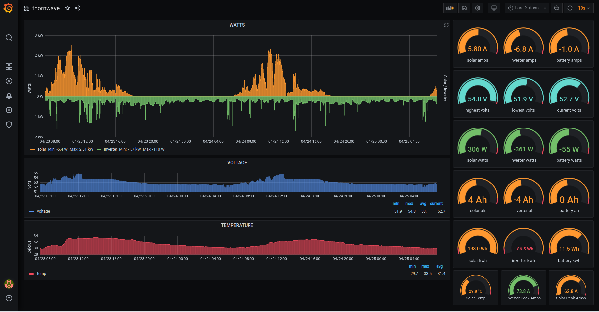

# bms
JBD BMS and Thornwave bluetooth data monitoring 

**JBD**

bms.py is a backend for using bluetooth to pull data from a JBD/Overkill BMS and then processing it for applications. 

The JBD BMS uses either serial or bluetooth to access its data and this project is for the bluetooth interface. The way JBD implemented this is not standard as in sending read requests or turning on notifications to receive data. It requires sending without data, write requests to handles (0x03 and 0x04), i.e. 'dda50400fffc77'. These messages cause the device to return a single notification response via a different handle. The returned notify is broken into 2 messages. The first is the start of the message and the second is the last half. 

So far I have only programmed the 0x03 (pack info) and 0x04 (cell voltages) for system monitoring.

bms.py alone is required. Just discover your JBD BLE address. I use hcitool lescan to find this or the Xiaoxiang app also shows this at startup. The bms.py program is initiated with a (-b) device BLE address, (-i) collection interval and (-m) monitor name.

*bms.py -b xx:xx:xx:xx:xx -i 10 -m jbdbms*

This program only prints out the data for testing and viewing until the sock commands are uncommented and Telegraf is setup to listen to socket and deliver data to influxdb. The output format can be changed to your own requirements and application.

It is using bluetooth (bluepy) for fetching data from a JBD BMS or Overkill BMS and building data structures then formatting it to cvs data and writing it to a unix socket for Telegraf's Socket Listener Input Plugin. The data then preceeds via Influxdb to Grafana for graphing. Telegraf is the middleman, collecting arriving data and getting it into Influxdb. Other than configuraton files the user only works with Grafana via a browser to access and graph data in dashboards. I included my Grafana bms dashboard json file that can be used as a template as seen below.

**Thornwave**

For my system, I also use two Thornwave bluetooth battery monitors. One for the solar charge controller and the other for an inverter. These are much simpler only requiring a read request at (0x15) which returns the data for processing. (these are well made and fairly inexpensive shunt monitors)

For Thornwave see https://github.com/mkjanke/ThornwavePy I have only modified it for cvs data, writing to Unix socket and leaving connection open for ongoing data. As I am using linux I am utilizing systemd services for the data collection, with automatic loading on startup and restarting if connection lost. The meters-socket.py is for the Thronwave meters.  I also included a Grafana Thornwave dashboard json file that can be used as a template as seen below.

*meters-sock.py -b CF:E5:F3:D1:9F:87 -i 30 -m solar*

I'm running this on a RaspberryPi Zero W and used Python 3.9. As Debian only has version 3.7, it required building 3.9 from source. This was only necessary because (In Python 3.9, new string methods removeprefix() and removesuffix() are introduced) and was too lazy to revert to earlier method.

I have only tested and used with linux but this should be okay from any python and bluetooth ready computer within bluetooth range. I use the RaspberryPi zero W for 24/7 and proximity to device's bluetooth signal and feed its webserver to give access to any device on my lan. 

Influx also offers a free cloud version of their database which would give the ability to access the bms from anywhere via the internet. Haven't tried this yet.

**SETUP**

It's very simple, first install *bms.py* or *meters-socket.py* or both, test data output, and then install *Telegraph, InfluxDB, and Grafana*. The default configurations are okay for both InfluxDB and Grafana. Remember to change print outputs to socket outputs by uncommenting.

For InfluxDB you need to create a new database and user with password. 

Open with terminal **influx** then type :
* CREATE DATABASE battery
* influx user create -n "username" -p "password" -o "org-name"
* exit

Telegraf configuration requires the following to be added :

[[outputs.influxdb]]
 * urls = ["http://127.0.0.1:8086"]
 * database = "battery"
 * username = "username"
 * password = "password"

[[inputs.socket_listener]]
 * service_address = "unixgram:///tmp/telegraf.sock"
 * data_format = "csv"
 * csv_header_row_count = 1
 * name_override = "battpack"
 * data_type = "float"  
 * csv_tag_columns = ["meter"]
  
That's it, now just need to open Grafana via urls used. If data doesn't appear on dashboards, can launch Telegraf with --debug option, making it output more information about errors in processing of data.
  
Linux users can automate start and restart via systemd
* copy service files to /etc/systemd/system/
* systemctl start bms.service
* systemctl enable bms.service
* systemctl start solar.service
* systemctl enable solar.service
* systemctl start inverter.service
* systemctl enable inverter.service
