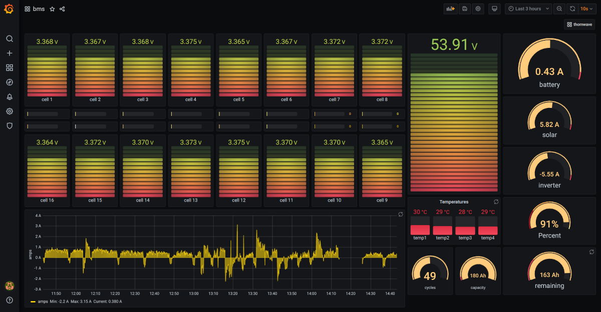

# bms
JDB and Thornwave data monitoring

This project is for using bluetooth (bluepy) for fetching data from a JBD BMS (Overkill) and formatting it as cvs data and writing it to a unix socket for Telegraf through its listening socket plugin. It is then preceeds to Influxdb and Grafana for graphing.

The JBD BMS uses bluetooth to broadcast its data. The way this is handled is not standard as in just reading data or turning on notifications.

It requires sending a, no data, write request, to handles (0x03, 0x04, or 0x05). These messages cause the device to return a single notification response via a different handle. The returned notify is broken into 2 messages. The first is the start of the message and the second is the last half.

So far I have only programmed the 0x03 (pack info) and 0x04 (cell voltages). I may expand this for the eprom settings at 0x05.

I also use two Thornwave bluetooth battery monitors. One for the solar charge controller and the other for an inverter. These are much simplier as they only require a read handle(0x15) and returns the data for processing.

The program is initiated with the MAC address, collection interval and monitor name.

bms.py -b xx:xx:xx:xx:xx -i 10 -m jbdbms.

I'm running this on a RaspberryPi Zero W and used Python 3.9.

For Thornwave data see https://github.com/mkjanke/ThornwavePy I have only modified it for cvs data, writing to Unix socket and leaving connection open for ongoing data. As I am using linux I am utilizing system services, with automatic restaring if connection lost, for the data collection.

